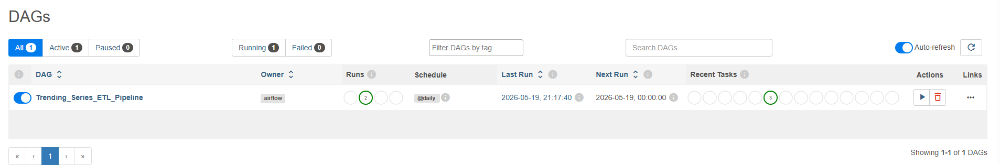

# Netflix Trending Series ETL Pipeline

## Overview

This project is an end-to-end ETL (Extract, Transform, Load) pipeline built using Apache Airflow, Python, Docker, and PostgreSQL. The pipeline extracts trending TV series data from the TMDB (The Movie Database) API, performs data cleaning and transformation using Pandas, and loads the processed data into a PostgreSQL database.

The project demonstrates fundamental data engineering concepts including workflow orchestration, data transformation, containerized services, and database integration.

---

## Project Architecture

The pipeline follows the ETL architecture below:

1. Extract
   - Fetches trending TV series data from the TMDB API.
   - Stores raw API response data for processing.

2. Transform
   - Cleans and processes the raw dataset using Pandas.
   - Removes duplicates and missing values.
   - Renames columns for readability.
   - Creates additional derived features.

3. Load
   - Loads the cleaned dataset into a PostgreSQL database table.
   - Makes the data queryable using SQL.

The workflow is orchestrated using Apache Airflow and runs inside Docker containers.

---

## Technologies Used

- Python
- Apache Airflow
- PostgreSQL
- Docker & Docker Compose
- Pandas
- SQLAlchemy
- Requests Library
- TMDB API

---

## Project Structure

```text
Netflix_ETL/
│
├── dags/
│   └── trending_series_etl_dag.py
│
├── scripts/
│   ├── extract.py
│   ├── transform.py
│   └── load.py
│
├── data/
│   ├── raw/
│   └── processed/
│
├── docker-compose.yml
├── .gitignore
└── README.md
```

---

## ETL Workflow

### 1. Extract Phase

The extract step connects to the TMDB API and retrieves weekly trending TV series data.

The extracted dataset includes fields such as:
- Series title
- Release date
- Rating
- Popularity
- Original language
- Description

The raw data is stored for further processing.

---

### 2. Transform Phase

The transform step performs multiple preprocessing operations on the raw dataset:

- Selected only relevant columns
- Renamed columns for consistency
- Removed null values
- Removed duplicate records
- Added a derived column called `rating_category`

Example logic:

- Rating >= 7 → High Rated
- Rating < 7 → Medium/Low Rated

The transformed dataset is then saved as a cleaned CSV file.

---

### 3. Load Phase

The load step reads the cleaned dataset and inserts it into a PostgreSQL database using SQLAlchemy.

The final table created in PostgreSQL:

```sql
trending_series
```

The data can then be queried directly using SQL.

Example query:

```sql
SELECT * FROM trending_series LIMIT 10;
```

---

## Apache Airflow DAG

The Airflow DAG orchestrates the ETL workflow using three tasks:

```text
extract >> transform >> load
```

Each task runs sequentially:
1. Extract data from API
2. Transform and clean data
3. Load data into PostgreSQL

---

## Dockerized Environment

The project uses Docker Compose to manage services including:

- Airflow Webserver
- Airflow Scheduler
- PostgreSQL Database

This ensures consistent and isolated execution across environments.

---

## PostgreSQL Integration

The project loads processed data into PostgreSQL using the following connection architecture:

- Database: PostgreSQL
- ORM/Connector: SQLAlchemy
- Driver: psycopg2

The PostgreSQL service runs inside a Docker container and is connected to Airflow through Docker networking.

---

## Running the Project

### 1. Clone the Repository

```bash
git clone https://github.com/YOUR_USERNAME/netflix-etl-airflow.git
```

### 2. Navigate to Project Directory

```bash
cd netflix-etl-airflow
```

### 3. Start Docker Containers

```bash
docker-compose up -d
```

### 4. Access Airflow

Open:

```text
http://localhost:8080
```

Default credentials:

```text
Username: admin
Password: admin
```

### 5. Trigger the DAG

Run the `Trending_Series_ETL_Pipeline` DAG from the Airflow UI.

---

## Database Verification

To verify the loaded data inside PostgreSQL:

```bash
docker exec -it <postgres_container_id> psql -U airflow -d airflow
```

Then run:

```sql
SELECT * FROM trending_series LIMIT 10;
```

---

## Learning Outcomes

This project helped demonstrate practical understanding of:

- ETL pipeline development
- Workflow orchestration with Airflow
- Docker containerization
- Data transformation using Pandas
- PostgreSQL database integration
- SQL-based data validation
- Handling Airflow task dependencies and debugging

---
## Screens



## Author

Zafar 

Software Engineering Student | Aspiring Data Engineer